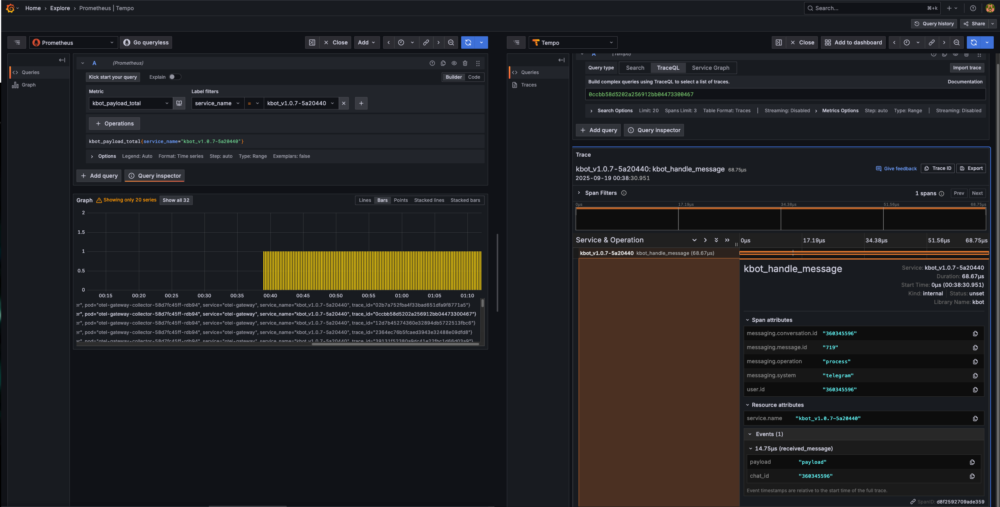

# Observability Stack Deployment Guide

Complete guide for deploying a production-ready observability stack using Flux, OpenTelemetry, Prometheus, Grafana, Loki, and Tempo on Kubernetes.

## Table of Contents

1. [Overview](#overview)
2. [Architecture](#architecture)
3. [Prerequisites](#prerequisites)
4. [Stack Components](#stack-components)
5. [Installation Order](#installation-order)
6. [Deployment Commands](#deployment-commands)
7. [Health Checks](#health-checks)
8. [Troubleshooting](#troubleshooting)
9. [Grafana Dashboards](#grafana-dashboards)
10. [PromQL Examples](#promql-examples)

## Overview

This observability stack provides:
- **Metrics**: Prometheus + OpenTelemetry metrics collection
- **Logs**: Loki + FluentBit for centralized logging
- **Traces**: Tempo for distributed tracing
- **Visualization**: Grafana with pre-configured datasources
- **Service Monitoring**: Custom ServiceMonitors for applications

The stack is deployed using Flux CD for GitOps-based management.

## Architecture


## Prerequisites

- Kubernetes cluster (GKE recommended)
- **Flux CD v2.0.0+ deployed and configured** (see [main.tf](../../main.tf) for Terraform deployment)
- kubectl configured and connected to your cluster
- Helm repositories access
- GitHub repository with Flux bootstrap configured

```bash
# Install Flux CLI
curl -s https://fluxcd.io/install.sh | sudo FLUX_VERSION=2.0.0 bash

# Verify cluster access
kubectl cluster-info

# Verify Flux is deployed and running
kubectl get all -n flux-system
flux check

# Ensure Flux controllers are ready
kubectl wait --for=condition=Ready pod -l app=helm-controller -n flux-system --timeout=300s
kubectl wait --for=condition=Ready pod -l app=source-controller -n flux-system --timeout=300s
kubectl wait --for=condition=Ready pod -l app=kustomize-controller -n flux-system --timeout=300s
```

### Flux Deployment
If Flux is not yet deployed, use the Terraform configuration to set up the complete infrastructure:

```bash
# Deploy GKE cluster with Flux using Terraform
terraform init
terraform apply

# This will create:
# - GKE cluster
# - Flux CD installation
# - GitHub repository with deploy keys
# - Workload Identity for SOPS encryption
```

## Stack Components

### Required Files Structure
```
flux-kbot-bootstrap/observability/
├── obs-ns.yaml                    # Namespace
├── obs-prometheus-hrep.yaml       # Prometheus Helm Repository
├── obs-grafana-hrep.yaml          # Grafana Helm Repository
├── obs-otel-hrep.yaml             # OpenTelemetry Helm Repository
├── obs-fluent-hrep.yaml           # FluentBit Helm Repository
├── obs-prometheus-hrel.yaml       # Prometheus Helm Release
├── obs-grafana-loki-hrel.yaml     # Loki Helm Release
├── obs-grafana-tempo-hrel.yaml    # Tempo Helm Release
├── obs-otel-operator-hrel.yaml    # OpenTelemetry Operator
├── obs-otel-collector.yaml        # OTEL Collector Configuration
├── obs-otel-service.yaml          # OTEL Service
├── obs-fluent-bit-hrel.yaml       # FluentBit Helm Release
├── obs-grafana-hrel.yaml          # Grafana Helm Release
├── obs-grafana-datasources.yaml   # Grafana Datasources
└── obs-otel-service-monitor.yaml  # ServiceMonitor for OTEL
```

## Installation Order

The deployment must follow this specific order due to dependencies:

1. **Namespace** (`obs-ns.yaml`)
2. **Helm Repositories** (all `-hrep.yaml` files)
3. **Prometheus Stack** (creates CRDs)
4. **Loki & Tempo** (log/trace backends)
5. **OpenTelemetry Operator**
6. **OpenTelemetry Collector & Service**
7. **FluentBit** (log collection)
8. **Grafana** (visualization)
9. **Datasources Configuration**
10. **ServiceMonitor** (requires CRDs from step 3)

## Deployment Commands

### Step 0: Initial Setup
```bash
export NS=observability

# Check Flux system
kubectl get all -n flux-system
kubectl get all -n observability
```

### Step 1: Create Namespace
```bash
kubectl apply -f flux-kbot-bootstrap/observability/obs-ns.yaml
kubectl get ns
```

### Step 2: Add Helm Repositories
```bash
kubectl apply -f flux-kbot-bootstrap/observability/obs-prometheus-hrep.yaml
kubectl apply -f flux-kbot-bootstrap/observability/obs-grafana-hrep.yaml
kubectl apply -f flux-kbot-bootstrap/observability/obs-otel-hrep.yaml
kubectl apply -f flux-kbot-bootstrap/observability/obs-fluent-hrep.yaml
flux get sources helm -A
```

### Step 3: Deploy Prometheus Stack
```bash
kubectl apply -f flux-kbot-bootstrap/observability/obs-prometheus-hrel.yaml
flux reconcile hr kube-prometheus-stack -n $NS
flux get hr -n observability
kubectl wait --for=condition=Ready hr/kube-prometheus-stack -n $NS --timeout=15m

# Ensure CRDs exist before any ServiceMonitor
kubectl wait --for=condition=Established crd/servicemonitors.monitoring.coreos.com --timeout=5m
kubectl wait --for=condition=Established crd/podmonitors.monitoring.coreos.com --timeout=5m
```

### Step 4: Deploy Loki & Tempo
```bash
# Deploy Loki
kubectl apply -f flux-kbot-bootstrap/observability/obs-grafana-loki-hrel.yaml
flux reconcile hr loki -n $NS
kubectl wait --for=condition=Ready hr/loki -n $NS --timeout=15m
flux get hr -n observability
kubectl get all -n observability

# Deploy Tempo
kubectl apply -f flux-kbot-bootstrap/observability/obs-grafana-tempo-hrel.yaml
flux reconcile hr tempo -n $NS
kubectl wait --for=condition=Ready hr/tempo -n $NS --timeout=15m
flux get hr -n observability
kubectl get all -n observability
```

### Step 5: Deploy OpenTelemetry Operator
```bash
kubectl apply -f flux-kbot-bootstrap/observability/obs-otel-operator-hrel.yaml
flux reconcile hr opentelemetry-operator -n $NS
kubectl wait --for=condition=Ready hr/opentelemetry-operator -n $NS --timeout=10m
flux get hr -n observability
kubectl get all -n observability
```

### Step 6: Deploy OpenTelemetry Collector
```bash
# Deploy the Collector CR (spec.config: | … YAML block)
kubectl apply -f flux-kbot-bootstrap/observability/obs-otel-collector.yaml
kubectl get all -n observability

# Service exposing OTLP/metrics endpoints
kubectl apply -f flux-kbot-bootstrap/observability/obs-otel-service.yaml
kubectl get all -n observability
kubectl -n observability get svc otel-gateway -o jsonpath='{.metadata.labels}{"\n"}{.spec.selector}{"\n"}'
```

### Step 7: Deploy FluentBit
```bash
kubectl apply -f flux-kbot-bootstrap/observability/obs-fluent-bit-hrel.yaml
flux reconcile hr fluent-bit -n $NS
kubectl wait --for=condition=Ready hr/fluent-bit -n $NS --timeout=10m
flux get hr -n observability
kubectl get all -n observability
```

### Step 8: Deploy Grafana
```bash
kubectl apply -f flux-kbot-bootstrap/observability/obs-grafana-hrel.yaml
flux reconcile hr grafana -n $NS
flux get hr -n observability
kubectl wait --for=condition=Ready hr/grafana -n $NS --timeout=10m

# Get Grafana admin password
kubectl -n observability get secret grafana -o jsonpath='{.data.admin-password}' | base64 -d; echo

# Port forward to access Grafana
kubectl -n observability port-forward svc/grafana 3001:80
```

### Step 9: Configure Datasources
```bash
kubectl apply -f flux-kbot-bootstrap/observability/obs-grafana-datasources.yaml
kubectl -n observability get cm grafana-datasources -o yaml | sed -n '1,60p'
kubectl -n observability logs deploy/grafana -c grafana-sc-datasources | tail -n 50
```

### Step 10: Deploy ServiceMonitor
```bash
kubectl apply -f flux-kbot-bootstrap/observability/obs-otel-service-monitor.yaml
kubectl -n $NS get servicemonitor
kubectl -n observability get servicemonitor otel-gateway -o yaml
```

### Final Verification
```bash
# Check all components
kubectl get all -n observability

# Access Grafana
kubectl -n observability get pods -l app.kubernetes.io/name=grafana
kubectl -n observability port-forward svc/grafana 3001:80

# Test Loki connectivity
kubectl -n observability exec deploy/grafana -c grafana -- \
  curl -s 'http://loki.observability.svc.cluster.local:3100/loki/api/v1/labels?since=10m' \
  | jq -r '.data[]' | sort | egrep 'k8s_|service_name|host_name'
```

## Health Checks

### OpenTelemetry Collector
```bash
kubectl -n observability logs deploy/otel-gateway-collector --tail=200 -f
kubectl logs -n observability deploy/otel-gateway-collector | grep -i error | tail -20
```

### FluentBit
```bash
kubectl -n observability logs ds/fluent-bit -c fluent-bit --tail=200 -f --prefix --max-log-requests=20
```

### Loki
```bash
kubectl -n observability logs -l app.kubernetes.io/name=loki --tail=200 -f
```

### Tempo
```bash
kubectl -n observability logs -l app.kubernetes.io/name=tempo --tail=200 -f
```

### Prometheus
```bash
kubectl -n observability logs sts/prometheus-kube-prometheus-stack-prometheus -c prometheus --tail=200 -f
```

### Grafana
```bash
kubectl -n observability logs deploy/grafana -c grafana --tail=200 -f
```

### Check Metrics Endpoint
```bash
kubectl port-forward -n observability svc/otel-gateway 8889:8889
curl localhost:8889/metrics | grep kbot
```

## Troubleshooting

### Common Issues

#### 1. Service Endpoint Issues
```bash
# Check service and endpoints
kubectl get svc -n observability otel-gateway --show-labels
kubectl get endpoints -n observability otel-gateway -o wide

# Fix service selector
kubectl -n observability patch svc otel-gateway \
  --type=merge \
  -p '{"spec":{"selector":{"app.kubernetes.io/instance":"observability.otel-gateway","app.kubernetes.io/name":"otel-gateway-collector"}}}'
```

#### 2. FluentBit Connection Issues
```bash
# Check FluentBit configuration
kubectl -n observability get cm -o name | grep -i fluent | xargs -r kubectl -n observability get -o yaml | \
  sed -n '1,2000p' | grep -nE '^\s*\[OUTPUT\]|name\s+opentelemetry|host\s+|port\s+|uri\s+|tls\s+|http_'
```

#### 3. OTEL Collector Configuration
```bash
# Check OTEL receiver configuration
kubectl -n observability get cm -o name | grep -i otel | xargs -r kubectl -n observability get -o yaml | \
  sed -n '1,2000p' | grep -nE 'receivers:|otlp:|protocols:|http:|grpc:|endpoint:|4318|4317'
```

### Diagnostic Commands
```bash
# Quick status helpers
kubectl -n observability get pods -o wide
kubectl -n observability get events --sort-by=.lastTimestamp | tail -n 50

# Flux controllers debugging
kubectl -n flux-system logs deploy/helm-controller -f | grep -Ei 'fluent-bit|loki|tempo|grafana|otel|prometheus'
kubectl -n flux-system logs deploy/source-controller -f | grep -Ei 'grafana|opentelemetry|prometheus'
```

## Grafana

After deployment, access Grafana at `http://localhost:3001` with:
- **Username**: `admin`
- **Password**: Retrieved from secret (see Step 8)

### Custom Dashboards


### Imported Dashboards


### Pre-configured Datasources

- **Prometheus**: metrics
- **Loki**: logs
- **Tempo**: traces




## PromQL Examples

### Container CPU Usage
```promql
sum by(pod) (rate(container_cpu_usage_seconds_total{container="kbot"}[$__rate_interval]))
```

### Pod Restart Count
```promql
sum by(pod) (increase(kube_pod_container_status_restarts_total{container="kbot"}[10m]))
```

### Custom Application Metrics
```promql
sum({__name__=~"kbot_.*_total", otel_scope_name="kbot_counter"})
```

### Grouped Custom Metrics
```promql
sum by(__name__) ({otel_scope_name="kbot_counter"})
```

## Application Integration

### OpenTelemetry Configuration

Your applications (like [kbot](cmd/kbot.go)) should be configured with:

```go
// Environment variable for OTEL endpoint
MetricsHost = os.Getenv("METRICS_HOST") // "otel-gateway.observability.svc.cluster.local:4317"

// Initialize OpenTelemetry Metrics
func initMetrics(ctx context.Context) {
    if MetricsHost == "" {
        log.Printf("WARNING: METRICS_HOST environment variable is not set. Metrics will not be exported.")
        return
    }
    
    exporter, err := otlpmetricgrpc.New(
        ctx,
        otlpmetricgrpc.WithEndpoint(MetricsHost),
        otlpmetricgrpc.WithInsecure(),
    )
    if err != nil {
        log.Printf("Failed to create exporter: %v", err)
        return
    }

    resource := resource.NewWithAttributes(
        semconv.SchemaURL,
        semconv.ServiceNameKey.String(fmt.Sprintf("kbot_%s", appVersion)),
    )

    mp := sdkmetric.NewMeterProvider(
        sdkmetric.WithResource(resource),
        sdkmetric.WithReader(
            sdkmetric.NewPeriodicReader(exporter, sdkmetric.WithInterval(10*time.Second)),
        ),
    )
    otel.SetMeterProvider(mp)
}

// Initialize OpenTelemetry Tracing
func initTracing(ctx context.Context) {
    if MetricsHost == "" {
        log.Printf("WARNING: METRICS_HOST environment variable is not set. Tracing will not be exported.")
        return
    }

    exporter, err := otlptracegrpc.New(
        ctx,
        otlptracegrpc.WithEndpoint(MetricsHost),
        otlptracegrpc.WithInsecure(),
    )
    if err != nil {
        log.Printf("Failed to create trace exporter: %v", err)
        return
    }

    resource := resource.NewWithAttributes(
        semconv.SchemaURL,
        semconv.ServiceNameKey.String(fmt.Sprintf("kbot_%s", appVersion)),
    )

    tracerProvider := sdktrace.NewTracerProvider(
        sdktrace.WithResource(resource),
        sdktrace.WithBatcher(exporter),
        sdktrace.WithSampler(sdktrace.AlwaysSample()),
    )

    otel.SetTextMapPropagator(propagation.TraceContext{})
    otel.SetTracerProvider(tracerProvider)
    
    tracer = otel.GetTracerProvider().Tracer("kbot")
}
```

### TraceID and SpanID Integration

The observability stack supports full correlation between **logs**, **metrics**, and **traces** using TraceID and SpanID. This enables powerful debugging and monitoring capabilities:

#### 1. Traces with Spans
Create traces for each operation to track request flow:

```go
// Create a new trace for each incoming message
ctx, span := tracer.Start(context.Background(), "kbot_handle_message")
defer span.End()

// Add message details as span attributes
span.SetAttributes(
    semconv.MessagingSystemKey.String("telegram"),
    semconv.MessagingOperationKey.String("process"),
    semconv.MessagingMessageIDKey.String(fmt.Sprintf("%d", m.Message().ID)),
    attribute.String("messaging.conversation.id", fmt.Sprintf("%d", m.Message().Chat.ID)),
    attribute.String("user.id", fmt.Sprintf("%d", m.Message().Sender.ID)),
)

// Add events for important operations
span.AddEvent("received_message", trace.WithAttributes(
    attribute.String("payload", payload),
    attribute.String("chat_id", fmt.Sprintf("%d", m.Message().Chat.ID)),
))
```

#### 2. Metrics with TraceID Correlation
Link metrics to specific traces for detailed performance analysis:

```go
func pmetrics(ctx context.Context, payload string) {
    meter := otel.GetMeterProvider().Meter("kbot_counter")
    counter, err := meter.Int64Counter(fmt.Sprintf("kbot_%s", payload))
    if err != nil {
        log.Printf("Failed to create counter: %v", err)
        return
    }

    // Get current span from context
    span := trace.SpanFromContext(ctx)

    // Create attributes with trace ID if span is valid
    if span.SpanContext().IsValid() {
        counter.Add(ctx, 1, metric.WithAttributes(
            semconv.ServiceNameKey.String(fmt.Sprintf("kbot_%s", appVersion)),
            // This links metrics to traces for correlation
            attribute.String("trace_id", span.SpanContext().TraceID().String()),
        ))
    } else {
        counter.Add(ctx, 1)
    }
}
```

#### 3. Logs with TraceID and SpanID
Include trace information in logs for complete observability:

```go
// logWithTrace adds trace information to the logs
func logWithTrace(ctx context.Context, logger *zerodriver.Logger, message string, payload string) {
    span := trace.SpanFromContext(ctx)

    if span.SpanContext().IsValid() {
        // Add both trace ID and span ID to logs
        traceID := span.SpanContext().TraceID().String()
        spanID := span.SpanContext().SpanID().String()
        
        logger.Info().
            Str("Payload", payload).
            Str("trace_id", traceID).
            Str("span_id", spanID).
            Msg(message)
    } else {
        logger.Info().Str("Payload", payload).Msg(message)
    }
}
```

### Complete Integration Example

Here's how all three telemetry signals work together in a request handler:

```go
kbot.Handle(telebot.OnText, func(m telebot.Context) error {
    // 1. Create a new trace for the operation
    ctx, span := tracer.Start(context.Background(), "kbot_handle_message")
    defer span.End()

    payload := m.Message().Payload
    
    // 2. Record metrics with trace correlation
    pmetrics(ctx, payload)

    // 3. Log with trace information
    logWithTrace(ctx, logger, m.Text(), payload)

    // 4. Create child spans for sub-operations
    switch payload {
    case "hello":
        _, childSpan := tracer.Start(ctx, "send_hello_response")
        err = m.Send(fmt.Sprintf("Hello I'm Kbot %s!", appVersion))
        childSpan.End()
    }

    return err
})
```

### Benefits of TraceID Integration

1. **Request Flow Tracking**: Follow a single request through all services and components
2. **Performance Analysis**: Correlate slow metrics with specific trace spans
3. **Error Debugging**: Link error logs to the exact trace and span where they occurred
4. **Service Dependencies**: Understand how services interact in distributed systems

### Grafana Correlation Features

With TraceID integration, you can:

- **Jump from Logs to Traces**: Click on a TraceID in logs to view the full trace
- **Correlate Metrics**: Filter metrics by TraceID to see performance for specific requests
- **End-to-End Visibility**: See logs, metrics, and traces for the same operation in one view
- **Root Cause Analysis**: Quickly identify which component caused an issue

### Environment Variables

Set these environment variables in your application deployment:

```yaml
env:
- name: METRICS_HOST
  value: "otel-gateway.observability.svc.cluster.local:4317"
- name: TELE_TOKEN
  valueFrom:
    secretKeyRef:
      name: kbot-secret
      key: token
```

## Notes

- All components are deployed in the `observability` namespace
- The stack uses Flux for GitOps-based management
- ServiceMonitors require Prometheus CRDs to be installed first
- FluentBit collects logs from all namespaces by default
- OpenTelemetry Collector acts as a central gateway for all telemetry data

## Next Steps

1. Configure more custom dashboards in Grafana
2. Set up alerting rules in Prometheus
3. Add more applications to the observability stack
4. Configure log retention policies
5. Set up metric federation if needed

---

For more information, see the source files in [tf-gke-flux/scripts/deploy-otel.sh](tf-gke-flux/scripts/deploy-otel.sh).